# EURODEER USERS GUIDE

* [Introduction](#Introduction)
* [EUROMAMMALS Project](#EUROMAMMALS)
* [EURODEER Database Overview](#EURODEER_Overview)
* [EURODEER Database Content](#EURODEER_Content)  
* [EURODEER Database Objects Description](#EURODEER_objects)  
* [Connecting with the Database](#connection) 	  
    * [phpPgAdmin](#phpPgAdmin)  
    * [pgAdmin](#pgAdmin)  
    * [QGIS](#QGIS)  
    * [R](#R)  
    * [LibreOffice](#LibreOffice)  
    * [Other Client Tools](#Others)  
   

If you read this page from github, you have an html version of this page with a better formatting: [http://feurbano.github.io/eurodeer_db/documentation/eurodeer_user_guide.html](http://feurbano.github.io/eurodeer_db/documentation/eurodeer_user_guide.html)

**LAST (important) UPDATE: 18 Dec 2018**

## <a name="Introduction"></a> Introduction  

The primary content of this manual is the technical documentation about the use of **EURODEER database** for the project partners.   
The first section, [EUROMAMMALS umbrella project](#EUROMAMMALS), is a general introduction to the EURODEER network and to the other federated initiatives (at the moment): **EUREDDEER**, **EUROBOAR**, **EUROLYNX**, **EUROWILDCAT** and the African network **AFRIMOVE**).  
The second section, [EURODEER Database Overview](#EURODEER_Overview), illustrates the characteristics of the EURODEER e-infrastructure and the data processing (acquisition, harmonization, quality check). It also provides a very general overview of  the main features of relational databases for they who do not have any background in data management.  
In the section [EURODEER Database Content](#EURODEER_Content), we describe the data that are stored in the EURODEER database and how they are organized.  
The section [EURODEER Database Objects Description](#EURODEER_objects) provides the information to retrieve the description of each table and field stored in the database.  
[Connecting with the Database](#connection) shows how data can be accessed, visualized, processed and downloaded using a set of common interfaces (i.e. [phpPgAdmin](#phpPgAdmin), [pgAdmin 3](#pgAdmin), [QGIS](#QGIS), [R](#R), [LibreOffice](#LibreOffice)). 	 

While the technical content is focussed on EURODEER database, it is a good reference also for EUREDDEER, EUROBOAR, EUROLYNX and EUROWILDCAT database users, as the e-infrastructure is shared and large part of the database objects is similar. 

## <a name="EUROMAMMALS"></a>   

**EUROMAMMALS** is an umbrella project that coordinates and connects different open, bottom-up projects that promote collaborative science among research institutes. It is based on knowledge and data sharing to investigate the movement ecology of European mammals in their different habitats and management regimes. At the moment (December 2018) the EUROMAMMALS network is made of five species-specific database: **EURODEER** (roe deer, *Capreolus capreolus*), **EUREDDEER** (red deer, *Cervus elaphus*), **EUROBOAR** (wild boar, *Sus scrofa*), **EUROLYNX** (Eurasian lynx, *Lynx lynx*) and **EUROWILDCAT** (European wildcat, *Felis silvestris silvestris*).

EUROMAMMALS is first of all an open network of researchers who collaborate to produce better science by sharing data and knowledge. It is based on species-specific spatial database that store shared movement data and a wide set of additional information on ungulate species. The aim is to investigate variation in their behavioural ecology along environmental gradients or population responses to specific conditions, such as habitat changes, impact of human activities, different hunting regimes.   
EURODEER, EUREDDEER, EUROBOAR, EUROLYNX and EUROWILDCAT partners are trying to fully explore the opportunities given by the new monitoring technologies for conservation and management at both local and continental scale. 

Even if EURODEER, EUREDDEER, EUROBOAR, EUROLYNX and EUROWILDCAT are open projects, the data in the three database are accessible only by whom actively contributes with data or expertise, according to what is stated in the EURODEER and EUROBOAR Terms of Use. Permissions are specific to each of the three databases (they who contribute to one of the three database, can access data only in that database).

The [EUROMAMMALS spatial databases](http://eurodeer2.fmach.it/phppgadmin/) are hosted at [Edmund Mach Foundation](http://www.fmach.it/).

More information on the projects, including activities, partners, outcomes and news can be found at their website:

* [EUROMAMMALS website](http://www.euromammals.org)
* [EURODEER website](http://www.eurodeer.org)
* [EUREDDEER website](http://www.eureddeer.org)
* [EUROBOAR website](http://www.euroboar.org) 
* [EUROLYNX website](http://www.EUROLYNX.org) 
* [EUROWILDCAT website](http://www.EUROWILDCAT.org) 

EURODEER financial resources come from the voluntary contributions of each partner. On top of this, since 2012, [Vectronic Aerospace GmbH](https://www.vectronic-aerospace.com/wildlife-monitoring/) is the official sponsor of EUORODEER project. It supports activities and spatial database development.

###  *Capreolus capreolus*

European roe deer is a very well studied species, because of its crucial role in European ecosystems and because it is a very good model species, both for ecological and evolutionary reasons. However, the time has come for synthesising our knowledge into a wider and more complex picture, that would allow to clarify ecosystemic relationships (e.g., resource balance), reveal evolutionary patterns (e.g., animal performance), and underpin predictions on future scenarios (e.g., climate change effect). The technological advancement, such as GPS collars and activity sensors, allowed to obtain large data sets of high quality. A spatial database populated with data from different study areas can support the development of a complete picture of roe deer biology, within a ecological and evolutionary context. At the same time, it offers the opportunity to join and harmonize the data of different research groups into a well supported, centralized repository, with transparent accessibility.  
These are the premises of the EUropean ROe DEER Information System (EURODEER).

The participation to the project and the use of the data stored in the database is ruled by the [Terms of Use](http://eurodeer.org/terms-of-use/) signed by each partner. It is a kind of gentlemen agreement mainly based on good sense. The most important point is "*The Partners maintain full property and control of their own dataset"*. No ownership is transferred and data are used only if data owners explicitly authorize it for each specific research. This also mean that data are not open to the public. But the network is open to any interested scientist.

### 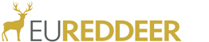 *Cervus elaphus*

While there is a specific database for red deer (EUREDDEER), the network (i.e., project partners) is shared between EURODEER and EUREDDEER that *de facto* belong to the same project. Consequently, most of the information provided about the EURODEER projects apply to both EURODEER and EUREDDEER database.

### 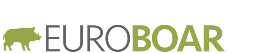 *Sus scrofa*

Wild boar is a very challenging species in terms of biology, demography and movement ecology. The species has an important human dimension, showing increasing interactions with environmental and socio-economic issues including spread of diseases. Developing science about wild boar should be the priority of many European regions because of its huge demographical and geographical expansion.  

The EUROBOAR project aims to take benefit from the experience of the existing EURODEER platform under the umbrella of EUROMAMMALS. It is first of all an open network of researchers who collaborate sharing data and knowledge to produce better science.  
EUROBOAR group is trying to fully explore the opportunities given by the new tracking  technologies for conservation and management at both local and continental scale. EUROBOAR group is also trying to explore the “non-movement” data usually collected on wild boar such like demographical parameters associated or not to tracking data.

The ultimate goal of the EUROBOAR project is to investigate ecological aspects that require the collaboration and data sharing of multiple institutes and researchers. Joining knowledge and information from different study areas and research projects open up many perspectives for scientists at both global and local scale. The final goal is to produce knowledge and in particular to support a science-driven sustainable management of environmental resources and conservation. EUROBOAR is about collaborative science.

Data sharing is only one of the elements. In fact, what is peculiar to EUROBOAR as compared to other data sharing projects is that the collection, quality control, harmonization and sharing of data and of the e-infrastructure to manage and analyze them is not an objective *per se*, for example to make available raw data and tools to third parties, but rather tasks needed to create a scientific network of scientists that collaborate to produce science.

The activities of the project that underpin the intense and motivating collaboration between researchers based on the shared data and tools can be summarized as follow:

* Effectively store and archive wild boar location data across Europe
* Encourage collaborations to work on several aspects of animal ecology jointly
* Inspire discussions to identify research gaps
* Promote accessibility of large scale datasets to address research questions at multiple spatio-temporal scales, as approved by data owners
* Promote education of young researchers, particularly on topics related to data management, movement ecology and collaborative science
* Create a larger network of collaborations with other projects, scientific communities, environmental managers
* Promote an open approach to science, which include both data sharing and use and development of open source tools

### 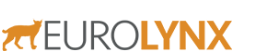 *Lynx lynx*

The project started in October 2018. The network and the sgared database are still being established.

### 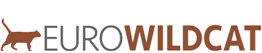 *Felis silvestris silvestris*

The project started in December 2018. The network and the sgared database are still being established.

## <a name="EURODEER_Overview"></a> EURODEER Database Overview

The main goal of EURODEER project is to join and harmonize roe deer tracking data and additional information from different research groups located in different European countries in a common data repository. To achieve this goal, we set up a software platform that enables all partners to access, manage and analyze the shared data in a cost-effective fashion. The main requirements of the project and the assessment of possible solutions are described in the paper [Wildlife tracking data management: a new vision ](http://rstb.royalsocietypublishing.org/content/365/1550/2177)(Urbano et al., 2013).

The result is a software platform based on a relational database management system with a spatial extension, built on the open source software [PostgreSQL](www.postgresql.org) (at 2017, version 9.5) and [PostGIS](www.postgis.org) (at 2017, version 2.3). It also includes the extension [Pl/R](https://github.com/postgres-plr/plr) that allows the integration of R tools into the database. The EURODEER database is physically installed on a server at Edmund Mach Foundation, but it is accessible from everywhere in the world (by users with registered account). It works as a centralized server that sends data, when requested, to client applications. A client is a software that accesses the remote service (database) on another computer system (server), by way of a network; the client application can be located anywhere and multiple connections to the database can be managed at the same time. Example of client applications are those used to manage the data (e.g., pgAdmin, phpPgAdmin), visualize spatial information (e.g., QGIS, ArcGIS) or perform analysis (e.g., R).

The server-client structure of the system offers the opportunity to build a very flexible and modular software platform, as any software able to connect to the central database can be integrated. Storing, managing, accessing and analysing GPS data from several research groups throughout Europe is thus possible, while each researcher can use its favourite software application, preserving the consistency of the data and avoiding data duplication with connected risk of errors. The most used applications to interact with the EURODEER database are Desktop GIS, statistics and Web tools, as well as office suites. 

In the section [Connecting with the Database](#connection) you can see some of these applications and how to connect them with the EURODEER database, while in [EURODEER Database Content](#EURODEER_Content) and [EURODEER Database Objects Description](#EURODEER_objects) you can explore database structure and content.  
In this section, you find an overview of the whole process from data acquisition to data ingestion into the EURODEER database, with a very short introduction to the main features of relational database. 

Note that this is not a comprehensive manual about database. It shortly describes the EURODEER database content and the main operations that can be done on it. There are information on how to connect with the database and visualize/download the data but not on how data can be combined or processed with the database language (Structured Query Language, SQL). 

For more advanced operations, some (even minimal) knowledge of SQL is needed. It is possible to learn about SQL and database though one of the many open tutorials, guides and courses available on the web. For example (among many others):
  
* [PostgreSQL official tutorial](https://www.postgresql.org/docs/current/static/tutorial.html)
* [postgresqltutorial](http://www.postgresqltutorial.com/)
* [w3resource](https://w3resource.com/PostgreSQL/tutorial.php)
* [sqlbolt](https://sqlbolt.com/)
* [webcheatsheet](http://webcheatsheet.com/sql/interactive_sql_tutorial/)
* [www.sql.org](www.sql.org)

An introduction to PostGIS (the spatial extention of PostgreSQL) give a look here:

* [PostGIS into by BoundlessGeo](http://workshops.boundlessgeo.com/postgis-intro/)

In addition, for they who want to understand the technicalities of (or replicate the) EURODEER database structure and tools or to get more skills on data management for wildlife tracking data, we suggest the book [Spatial Database for GPS Wildlife Tracking Data- A Practical Guide to Creating a Data Management System with PostgreSQL/PostGIS and R](https://www.springer.com/us/book/9783319037424) (Urbano & Cagnacci Ed., 2014). You can find a digital version of the chapters of the book in the [EURODEER documents repository](http://eurodeer.org/internal-documents/) (for EURODEER partners).

EURODEER **database manager** (Ferdinando) and **data curators** (Johannes) are always available for EUROMAMMALS databases users whenever technical support is needed in collaboration with the data curators of each network. For example for:  

* preparation of data before they are sent to EURODEER for uploading to the shared database
* creation/management of users
* advanced manipulation of data, specially for research connected with EURODEER papers 
* use of environmental data or integration of new ancillary data sets
* questions on data content
* fix of data errors

### EURODEER data work flow

#### Data collection
Data stored in the eurodeer_db is collected by project partners who fully own the data. No data are collected by EURODEER project itself, which is instead a project to share data of individual institutions. Nevertheless, having to harmonize data sets from different sources, EURODEER partner decided to identify a set of data collection protocols that facilitate the integration and comparison of information from different institutions. There is no obligation to adopt these protocols but they are considered a useful reference. Documents with the protocols are available to project partners (restricted access) in the [EURODEER web site](http://eurodeer.org/protocols-for-data-collection/).

#### Data harmonization
The most complicated challenge in the creation of the eurodeer_db has been (and still is) the harmonization of data sets from different sources. First of all, it is necessary to identify a set of information that are collected by all (or at least most of) the partners. Then, even when the information is related to the same objects phenomena, it can be collected, coded or stored in different ways (e.g., sampling methods, units, classes). The data have been processed to speak "the same language". In some cases this requires the aggregation of the original data, but this is the only way to run analysis over different areas and environmental gradients.  
Particularly, data owners are asked (with the support of the EURODEER data curators) to format the data in order to be consistent with the eurodeer_db. On the EURODEER web site, [guidelines](http://eurodeer.org/protocols-for-data-preparation/) (restricted access) are available about how to prepare the data sets.  
Whenever a new kind of information is integrated into the database (e.g., hinting pressure) a discussion among EURODEER partners is promoted to identify the information to be included.  
Then, it is up to the database manager and data curators to process data and upload into the database.

#### Quality checks

Tracking data (and in general wildlife monitoring data) can potentially be affected by a large set of errors in different steps of data acquisition and processing. Erroneous data can heavily affect analysis, leading to biased inference and misleading wildlife management/conservation suggestions. Data quality assessment is therefore a key step in EURODEER data management. In fact, a key step in the upload of data from partners to the shared database is quality check. Even if data are supposed to be quality checked by data owners, thanks to the procedures and protocols implemented into the database (and to the functionalities available in a proper database vs other simpler way to store data), many potential errors and inconsistencies are detected when screened by EURODEER data curators. The errors are then reported to data owners who provide the information to fix them, in an iterative process that might require several steps. No data is removed from the data set. Erroneous information are flagged as such keeping the synchronization with the original data set. While in some cases incorrect data are evident, in many situations, it is not possible to clearly identify information as outliers (even by they who collected the information) because although they are suspicious they might still be correct, leaving a margin of uncertainty. In this case a specific flag is used so data can be excluded from analysis, according to the criteria defined in each case.  
The continuous quality check, not only through automated algorithms, is a distinctive trait of the EURODEER approach as compared to other larger shared repository. And this is because quality of scientific output is the main concern of the project.

### A very short introduction to database for data management

#### Database and spatial database
A database is an application that can store and manage a large amount of data very efficiently and rapidly. The relational bit refers to how the data is stored in the database and how it is organized. In a relational database, all data is stored in tables. These have the same structure repeated in each row (like a spreadsheet) and it is the relations between the tables that make it a "relational" table.  
The use of a RDBMS has several advantages.

* It has a persistent and very large data storage capability.
* GPS data can be linked to complex spatial and non-spatial data in a common data structure.
* Multiple users can simultaneously access to data with different permissions levels.
* It has the ability to manage different time and spatial reference systems in the same frame.
* It has fast data search and retrieval capabilities.
* It supports controls on data consistency and reduce errors.
* It can implement automated procedures to receive, screen, and store data from GPS telemetry devices.

Spatially enabled relational database management systems (also called "spatial database", "Spatial Relational DataBase Management System - SRDBMS", "geodatabase") are database designed to store, query, and manipulate spatial data. The main advantage of SRDBMS, as compared to flat file based spatial data storage, is that they let a GIS build on the existing capabilities of RDBMS. This includes support for SQL and the ability to generate complex geospatial queries. While traditional GIS are focused on advanced data analysis and visualization, providing a rich set of spatial operations, on few data; spatial databases allow simple spatial operations which can be efficiently undertaken on a large set of elements. This approach suits perfectly the peculiarities of GPS data. Spatial database and GIS software can be integrated in the EURODEER platform, to take advantages of both approaches.

#### SQL
The database support SQL language. SQL is short for Structured Query Language and is a simple language that provides instructions for building and modifying the structure of databases and, most importantly for EURODEER users, for retrieving and modifying the data stored in the tables. 

SQL commands have a syntax similar to the common language. They begin with a command statement describing the action to take (e.g. SELECT), followed by a clause that describes the target of the command (such as the tables affected by the command) (e.g. FROM) and finally, a series of clauses that provide additional instructions that usually specify the subset of data needed by the users (WHERE).

An example is : 

```sql 
SELECT animal_id FROM main.animal WHERE sex = 'f';
```

The information returned is the *animals_id* stored in the table *main.animals* (i.e. name of the schema + "." + name of the table) for all those individuals that are female.

The SELECT clause specifies one or more columns to be retrieved; to specify multiple columns, use a comma and a space between column names. To retrieve all columns, use the wild card * (an asterisk).  
The FROM clause specifies one or more tables to be queried. Use a comma and space between table names when specifying multiple tables.  
The WHERE clause selects only the rows in which the specified column contains the specified value. The value is enclosed in single quotes when it is a text.  
The semicolon (;) is the statement terminator.   
SQL is not case sensitive (i.e., SELECT is the same as select).

Although there are different dialects of SQL, it is very standardized and the same syntax can be used with minimal changes in most of the commonly used database platform (both commercial and open source).

There are many (but not too many) other SQL commands to retrieve data (e.g. order by, limit, left/right join, group by, having) and a long list of useful functions to deal with the different data types. Some resources where you can learn more about SQL are suggested in the [Introduction](#Introduction).  

Some additional resources for spatial SQL with raster data produced by the EUORDEER project are available [here](https://github.com/feurbano/integration_raster_tracking_data).

In 2013, EURODEER organized a course on SQL and the use of eurodeer_db in Venice, Italy.

#### Main database objects
* **Schemas**. A database contains one or more named schemas, which in turn contain tables. Schemas also contain other kinds of named objects, including data types, functions, and operators.  
Schemas are used to organize database objects into logical groups, to make them more manageable, and to allow many users to use one database without interfering with each other. Schemas are similar to folders in a file system.
* **Tables**. The table is where all the data in a database is stored.Each table is made up of rows and columns. Each row in a relational is uniquely  identified by a primary key.  This can be by one or more sets of column values. Every relational table has one primary key.  Its purpose is to uniquely identify each row in the database. Columns are defined to hold a specific type of data, such as dates, numeric, or textual data. A table has a specified number of columns, but can have any number of rows.
* **Data type**. Each column in a table is associated to a data type that specify the kind of information that can stored (e.g. integer, float, text, date, polygons) and therefore the type of operations that can be performed on it (e.g. sum, division, concatenation, calculation of time interval, calculation of an area).
* **Indices**. An index is an optional structure, associated with a table, that can speed data access in a similar way an index in a book can help to find faster the information you are looking for (if the index refers to useful information in your search criteria).
* **Constraints**. Constrains define certain properties that data in a database must comply with. Common kinds of constraints are:
  * **primary key** - value(s) in specified column(s) must be unique for each row in a table and not be NULL; normally each table in a database should have a primary key - it is used to identify individual records
  * **foreign key** - value(s) in specified column(s) must reference an existing record in another table (via it's primary key or some other unique constraint)
  * **not null** - each value in a column must not be NULL
  * **unique** - value(s) in specified column(s) must be unique for each row in a table
  * **check** - an expression is specified, which must evaluate to true for constraint to be satisfied  

* **Triggers**. A trigger is a specification that the database should automatically execute a particular function whenever a certain type of operation is performed on a particular table in the database. The trigger fires a specific function to perform some actions BEFORE or AFTER records are DELETED, UPDATED, or INSERTED in a table. The trigger function must be defined before the trigger itself is created. The trigger function must be declared as a function taking no arguments and returning type trigger. For example, when you insert a new record in a table, you can modify the values of the attributes before they are uploaded or you can update another table that should be affected by this new upload.
* **Views**. A view is the result set of a stored query on the data, which the database users can query just as they would in a persistent database collection object. This pre-established query command is kept in the database dictionary. Unlike ordinary base tables in a relational database, a view does not form part of the physical schema: as a result set, it is a virtual table computed or collated dynamically from data in the database when access to that view is requested. Changes applied to the data in a relevant underlying table are reflected in the data shown in subsequent invocations of the view. 
* **Functions**. A function is a program code that is implemented inside the database using SQL or a set of other languages (e.g. PSQL, Python, C). Functions allow you to create complex processes and algorithms when plain SQL queries alone cannot do the job. Once created, a function becomes part of the database library and can be called inside SQL queries.
* **Domains**. A data domain refers to all the values which a data element may contain. The rule for determining the domain boundary may be as simple as a data type with an enumerated list of values. Domains can help to keep the integrity of the database restricting the accepted values to a set of valid options. A domain can be implemented as list of values stored in the so-called look up table or as a constraint (check) to the specific column. The data type per se limit the set of accepted values (e.g. an integer cannot accept character as valid value).
* **Users**. In a database, multiple users can access data at the same time, and the database server manage the different requests and ensure the consistency of the data. Each user can be associated to different permission levels on different database objects. For example, a defined user can edit and even delete some tables, while can only visualize some other tables or have no access at all on others. The database administration has full control of all database objects. Permissions can also be associated with user groups, in which case new users can be added to each group and will inherit all the related permissions on database objects. 
 
#### Data modelling 
Data models are the logical core of DBMSs and allow linking and integration of data sources by means of complex relationships; this is not only necessary for consistently structuring the database, but is also an extremely useful way to force users to clarify the ecological/biological relational links between groups of data.  
As database systems grow in size and complexity, and user requirements get more sophisticated, (spatial) data modelling becomes more important. A data model in a database framework (typically, relational or object-relational) describes what type of data are stored and how they are organized. It can be defined as a conceptual representation of the real world in database structures that include data objects (i.e. tables), associations between data objects, and rules that govern operations on the objects, thus explicitly determining their spatial and non-spatial relationships.  
Data modelling permits easy update, modification and adaptation of the database structure to accommodate changing goals, constraints and spatial scales of studies, and the evolution of wildlife tracking systems. Without a rigorous data modelling approach, an information system might lose the flexibility to manage data efficiently in the long term.

#### Why open source software 
Although any application that support standard database connection can be used with the EURODEER software platform, the database itself and many powerful applications (e.g., R, QGIS) are open source. Open source software tools were selected, first of all, because there are no resources available to buy software licences. More importantly, we decided to use PostgreSQL/PostGIS because open source tools in the domain of spatial data management and analysis are efficient, powerful and able to support a web-based multi-user environment. They meet all the requirements raised in the requirement analysis as they offer a complete set of software to efficiently implement ecological applications. Another core characteristic of open source tools relevant to the project is the use of standards, specially in the case of database software, that ensure interoperability and thus enable all the project's participants to connect the database with a large set of client applications with no need to buy specific software to exploit the shared information. Adopting international data and metadata standards is the only way to ensure interoperability between different information systems, both within and outside a single organization.

Finally, open source philosophy is perfectly in line with knowledge sharing perspective that guides the EURODEER project. 

## <a name="EURODEER_Content"></a> EURODEER database content

The EURODEER database is the repositories where data coming from the different partners of the EURODEER network are harmonized, stored and shared to be analyzed. The first goal of EURODEER is to investigate variations in roe deer behavioural ecology along environmental gradients or population responses to specific conditions, such as habitat changes, impact of human activities, different hunting regime. Therefore, the main set of data stored into the EURODEER database are those generated by biotelemetry sensors to monitor animals movement, particularly:

* GPS data
* VHF data
* Accelerometer data

These are the core information that was initially collected and shared in the EURODEER framework. After some years, we realized that while these data sets provide a huge mine of data to dig, it is when they are couple with additional information like that of the individuals, populations, management regimes and the environment that they can help to fully decipher the mechanisms of animals movement. This is why in the last years EURODEER has been and is still investing a lot in getting these additional information from each partner, harmonize them and integrate into the analysis. This is a complex process but ultimately it is the biggest added value of the collaboration among scientist on top of the integration into a single repository of the data coming from sensors. The work of data harmonization requires long and iterative discussions but it is also an opportunity to identify good practice (e.g. data collection protocols) that can then be shared with a wider scientific community.

Sensor data sets (GPS, VHF, accelerometer) in addition to the measures collected by the sensors include the list of animals (with key attributes like sex and age), the list and type/model of sensors, and the start and end of sensor deployment (with the reason for the end of deployment).
In addition to sensor data, at the moment in the EURODEER data sets we have information on:

* Research groups, study areas and sub-areas
* Intra- and inter-species interaction and human pressure (predation, competition, human pressure)
* Captures
* Contacts
* Feeding sites
* Environmental data

A short description of the information content of these data sets is reported in the next sub-sections together with a diagram of the data model. In the document **[eurodeer_db Dictionary](eurodeer_db_dictionary.md)** is reported the full description of each table/attribute.

Here below there is a schema that summirize all the main elements of the database at 2019-06-13 (click on it to enlarge).
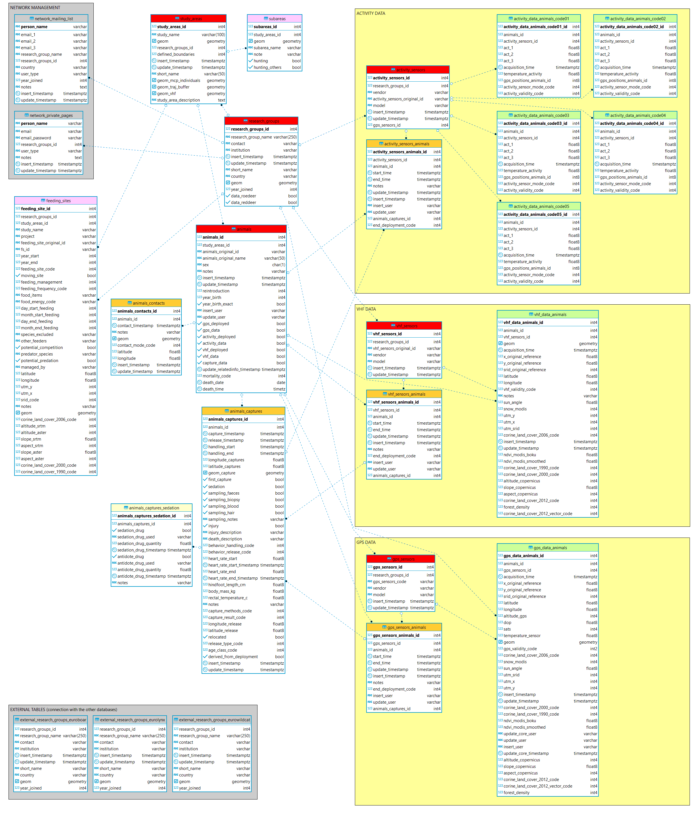

All the core information is stored in the schema **main**, with the exception of the environmental data that are available in the schema **env_data** and the schema **env_data_ts** (for layers with a time series, e.g., NDVI and snow). In the schema **tools** there are the functions created by EURODEER to process and analyze the data (see [functions](eurodeer_db_functions.md)). The schema **analysis** is used to store informations related to analysis that can be reused by all EURODEER partners. The working schema **ws\_*** are spaces where each partner institution can create table and process the data (one per institute). Finally, in the **lu_tables** schema, the database stores all the look up tables, i.e., those tables used to define (code) a valid domain of values for specific fields (e.g., the list of capture methods).

### Research groups, study areas and sub-areas
Sensor data are always related to animals. Each animal is assigned to one (and only one) study area. Each study area belongs to (is monitored by) a research group. The same research group can have more than one study area. Each study area is divided into one or more sub-areas, that roughly recall the concept of population. Each sub-area is characterized by a set of information (human disturbance, performance, predators, interspecific competition, hunting pressure, road density, which are collected every one or more years. Sensors (GPS, VHF, accelerometer) are also attributed to a specific research group.
In the view **main.view_reasearch_groups_euroungulates** all the groups belonging to EUROUNGULATES are reported (through external tables that connect with EUREDDEER and EUROBOAR database).
  
The entity-relationship (ER) diagram of the tables at 2018-02-01 is reported here below (click on it to enlarge).
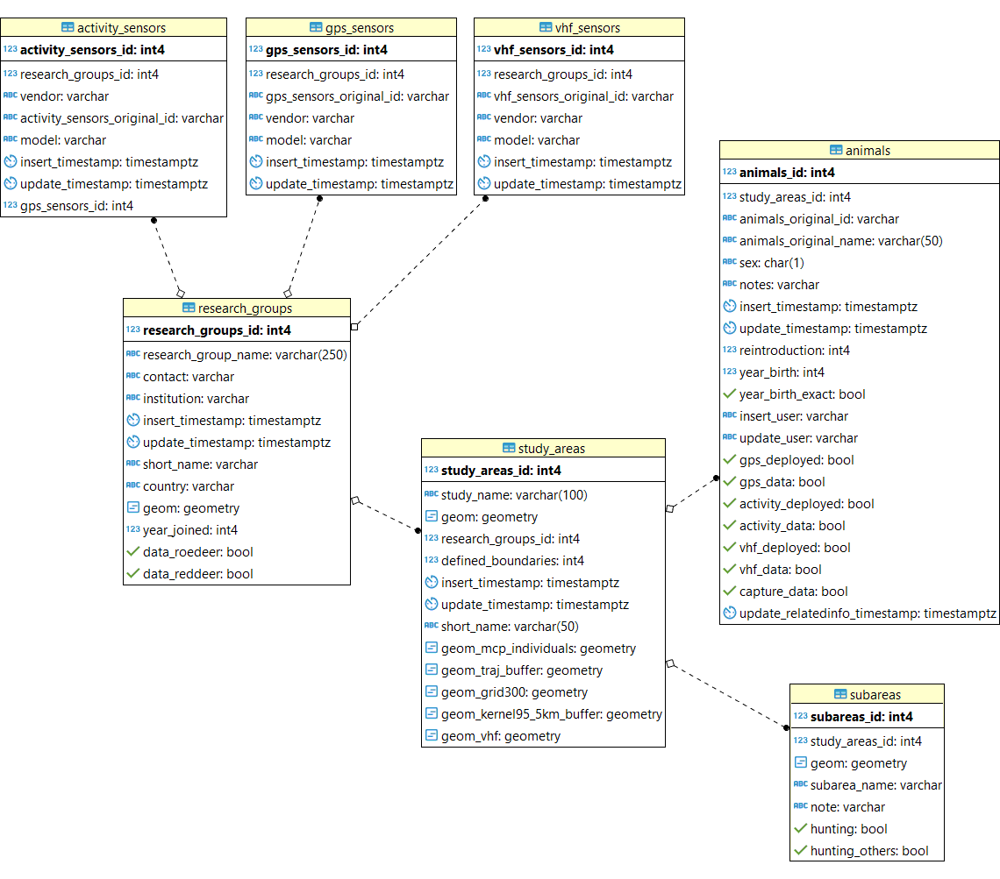

### GPS data
GPS locations are stored already associated to animals (which is a non-trivial step, specially when the same sensor is associated to different animals once recovered from the previous one). The locations, with a list of derived ancillary information calculated using the information on coordinates and acquisition time, and intersecting with environmental layers are stoerd in the table **main.gps_data_animals**. The original file coming from the sensor is not stored in EURODEER as in the database are shared data already preprocessed by the partners and only quality checked before being uploaded into eurodeer_db. It is important to note that all the outliers are not removed from the dataset but flagged using the field *gps_validity_code*. This includes, among the others, records with no coordinates, records with wrong coordinates, record with suspicious coordinates, records not registered while the sensor was deployed on the animal. When data are analyzed, records must be selected according to the quality level required by the specific analysis.  
The information on the deployment are stored in the table **main.gps_sensors_animals**, including the reasons of the end of the deployment. This table is used to check the correct attribution of locations to animals in the table **main.gps_data_animals**. Information on sensors are stored in **main.sensors**, while the information on animals in **main.animals**. A set of look up tables are used to store the list of valid values for some columns of these tables.  
In the views **analysis.view_convexhull** and ** analysis.view_trajectories** are available the trajectories and convex hull polygons related to each animal (and dynamically updated). These can be loaded in QGIS for spatial visualization. In the view **analysis.view_ltraj_class** data are formatted according to [R adehabitat package](https://cran.r-project.org/web/packages/adehabitat/adehabitat.pdf) to facilitate the import for analysis. See **[eurodeer_db Dictionary](eurodeer_db_dictionary.md)** for the complete list of view associted to GPS data.

The entity-relationship (ER) diagram of the tables at 2018-02-01 is reported here below (click on it to enlarge).
<center>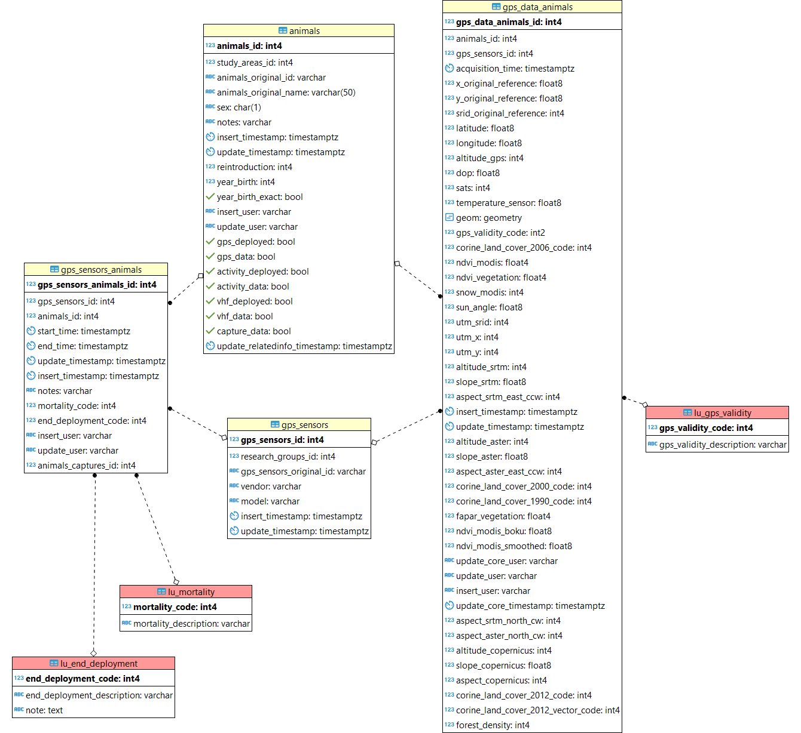</center>


### VHF data
VHF data content and structure is very similar to the one illustrated for GPS.
 
The entity-relationship (ER) diagram of the tables at 2018-02-01 is reported here below (click on it to enlarge).
<center>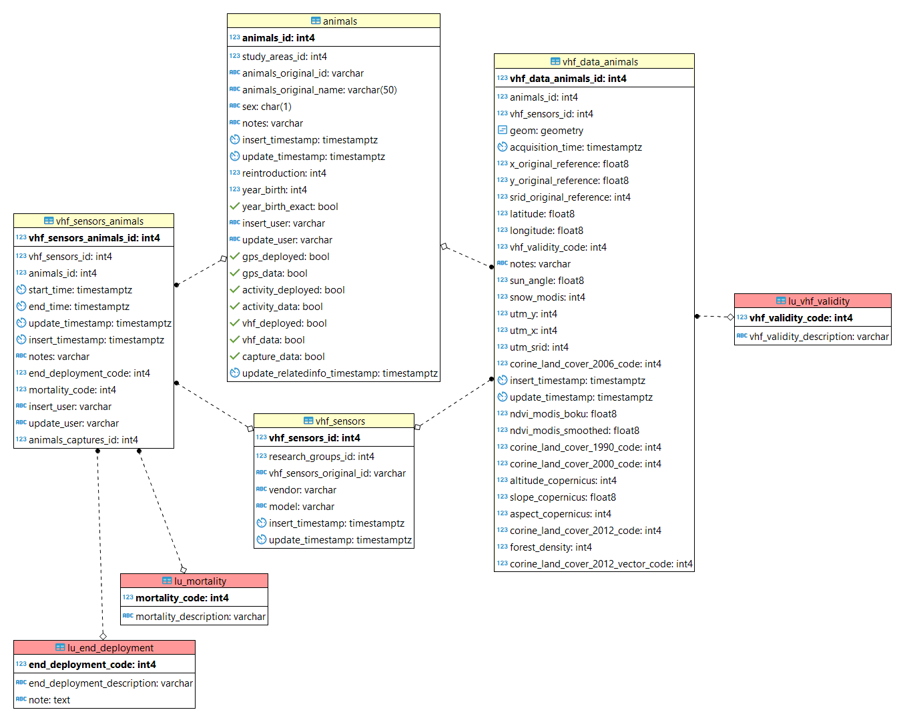</center>


### Accelerometer data
Accelerometer (sometimes also called *activity*) data content and structure is very similar to the one illustrated for GPS. In this case there are 5 tables called **main.activity\_data\_animals\_code\***. Given the size of the dataset, and the different kind of sensors that measure accelerometer, each table is associated to animals with a specific type of sensor (see table **lu_tables.lu\_activity\_sensor_mode**). As data come from different types of sensors, the information must be properly precessed to be correctly analyzed. The data stored in these tables are already an aggregation of the original data coming from sensor. The original data are stored in a different schema (**activity_data_raw**).

The entity-relationship (ER) diagram of the tables at 2018-02-01 is reported here below (click on it to enlarge).
<center>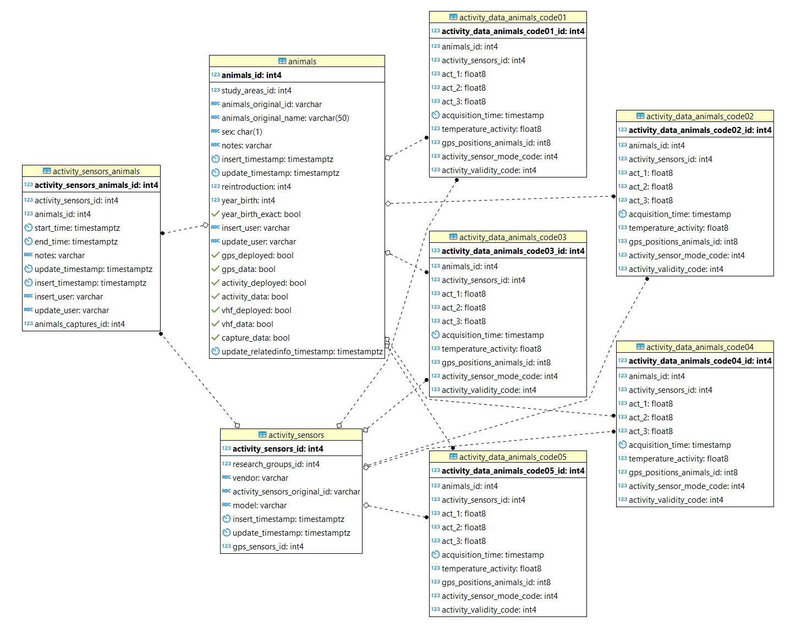</center>

### Sub-areas (predation, competition, human pressure)
Each sub-area is characterized by a information on different aspects.

* Estimation of roe deer density. The information is linked to the method of estimation, and can have an estimation per year per method of estimation. If know, also the start and end date of the sampling is reported, otherwise only the year and optionally the season.
* Human disturbance (tourism, agriculture, forestry works). This information is expected to change very slowly, but a reference year is given in case a long term monitoring is done.
* Hunting periods per sex (male and female). The periods have a start (and end) month and day. More than a period per year is possible. If the period is across years, it is divided in two sub periods (until 31 December and from 1st of January) As this information can change (e.g. modification to the hunting regulation). The time interval of validity can also be specified.
* Hunting periods for species different from roe deer. 
* Table with information on statistics taken from animals hunted and measured for biometry related to a specific year. 
* Roe deer inter-specific competitors. The information is linked to the method of estimation, and can have an estimation per year per method of estimation. If know, also the start and end date of the sampling is reported, otherwise only the year and optionally the season.
* Predators density. Each estimation for each predator for each year and for each sampling method corresponds to a row. The id of the species is linked with **main.species** where all the species are listed. If available, an estimation of the density is given as class and (if possible) number of individual per squared kilometre, otherwise only presence/absence is reported.
Estimation of road density. The value is linked to a specific year. It might change both because the road network change or because the areal of the subarea changes.

The entity-relationship (ER) diagram of the tables at 2018-02-01 is reported here below (click on it to enlarge).
<center>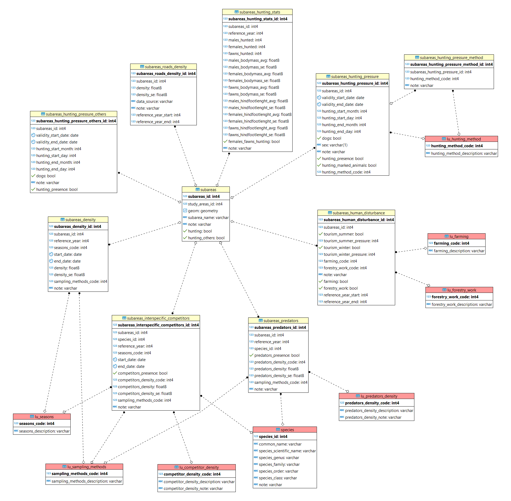</center>

### Captures
Information on captures are stored in the database in the tables **main.animals_captures** and **main.animals_captures_sedation** (many sedation records can be associated to a capture event). Every animal can be captured more than once. Only captures of animals that have been monitored are included. This includes successful collaring, but also recapture of a collared animal or failed collaring because for example the death of the animal during the capture (it is possible to have a capture event without any deployment registered). All capture events of monitored animals are recorded in this table. Each deployment is associated to a capture.

The entity-relationship (ER) diagram of the tables at 2018-02-01 is reported here below (click on it to enlarge).
<center>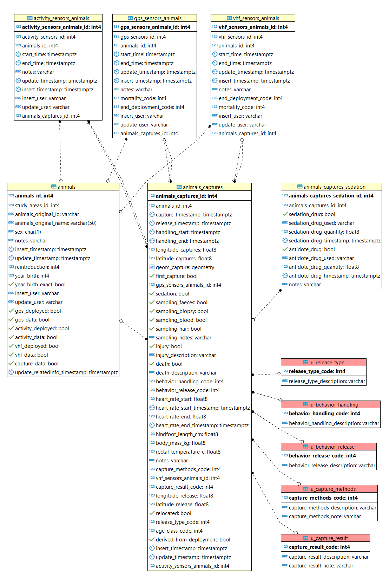</center>

### Contacts
This dataset keeps track of the information on contacts with animals. These can be both sightings of the animal – dead or alive – or the finding of the sensor, or others. This information is specially useful for survival analysis. All contacts with the animals are reported here with the exception of the contacts when the animal is captured (see table **main.animals_captures**). The view **main.view_survival** joins the information in **main.animals_contacts** and **main.animals_captures** for a complete history of the contacts with the animal. If a deployment ends because of the death of an animal, while this is marked in the *end_deployment_code* in the deployment table, the information on the death (i.e. the reason) is recorded in the table **animals_contacts**.

The entity-relationship (ER) diagram of the tables at 2018-02-01 is reported here below (click on it to enlarge).
<center>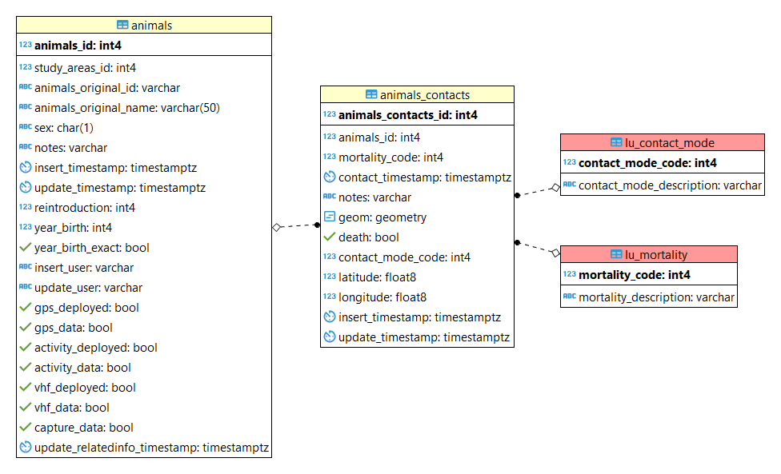</center>

### Feeding site
This data set contains the information on the management of the feeding sites, including where these are used.

The entity-relationship (ER) diagram of the tables at 2018-02-01 is reported here below (click on it to enlarge).
<center>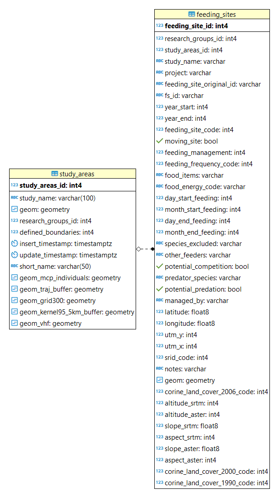</center>

### Environmental data
Spatial data collected with tracking devices are coupled in the database with environmental information coming from external environmental monitoring projects. These layers are aailable consistently for all Europe so they can be associated to tracking data of all study areas and thus be compared. Some layers are statics while others are time series. The collection and integration of these external sources is challanging but it is key to represent the information derived from sensors in an ecological rather then a simple geographical space. A syntetic list of environamental layers available in the database is reported below. More information are available on the [EURODEER web site](http://eurodeer.org/environmental-covariates/). 

* Administrative units (European sub national administrative units; vector)
* DEM, Aspect and Slope from Copernicus project (raster)
* Corine Land Cover (1990, 2000, 2006, 2012; raster)
* Corine Land Cover (2012; vector)
* NDVI Constancy, Contingency, Predictability (raster)
* NDVI MODIS (raster; time series)
* SNOW MODIS (raster; time series)
* Winter Severity (raster; time series)

## <a name="EURODEER_objects"></a> EURODEER Database Objects Description
Every single object in the eurodeer_db (schemas, tables, columns, views, functions) is described inside the database (as [comment](https://www.postgresql.org/docs/devel/static/sql-comment.html)). The descriptions are visible in all db interface (e.g., pgAdmin) when the element is selected. 

An extended report, **[eurodeer_db Dictionary](eurodeer_db_dictionary.md)** that includes the description of the objects of the database (generate with this [SQL code](generate_database_dictionary_sql/generate_dictionary.md) in markdown format, taking the comments from the database itself).

## <a name="connection"></a> Connecting with the Database

[PostgreSQL](https://www.postgresql.org/) is a database server. The role of the database server is to distribute data to client applications keeping the data into a centralized repository. Many different interfaces can be used. Some are focussed on the creation, maintenance and development of the database, others to visualize and edit/manipulate tabular or spatial data. Statistical tools can be used to perform analysis on the data. Many graphical interface can be used to offer data in a user-friendly fashion, including through web applications.  
Users with a permission to access the data can use their favourite application. Examples of how to connect with the database from different software tools are reported in the next sub-section.   
You do **NOT** need to install PostgreSQL to connect with EURODEER db. The database is stored on a PostgreSQL server at the Edmund Mach Foundation. You only need a client application, or, in the case of phpPgAdmin, a web browser (e.g. Mozilla Firefox).

Any client need the following parameters to connect with the database:

	  IP or Domain name of the server: eurodeer2.fmach.it
	  Server Port: 5432
	  Name of the Database: eurodeer_db
	  User Name: ...
	  Password: ...

If you don't have yet a user account (and you are entitle to have one) please contact Francesca Cagnacci or Ferdinando Urbano. We will create an account for you (with a permission level that corresponds to your role in the project)

In the next subsections, you can learn how to connect, visualize data and download data with a set of client applications.

### <a name="phpPgAdmin"></a>phpPgAdmin
phpPgAdmin is a web-based administration tool for PostgreSQL written in PHP. You can see the database content, display and download data and run any SQL statement. You do not need to install any software as it only requires that you have a web browser.  
The interface is very intuitive and similar to PgAdmin, with a structure pretty similar to a file system explorer.    
While for basic operations this tool is very good, we recommend to use pgAdmin for more intense or sophisticated interactions with the database.

To connect with the database, go to the web page [http://eurodeer2.fmach.it/phppgadmin/](http://eurodeer2.fmach.it/phppgadmin/) and enter your credentials (see image below).

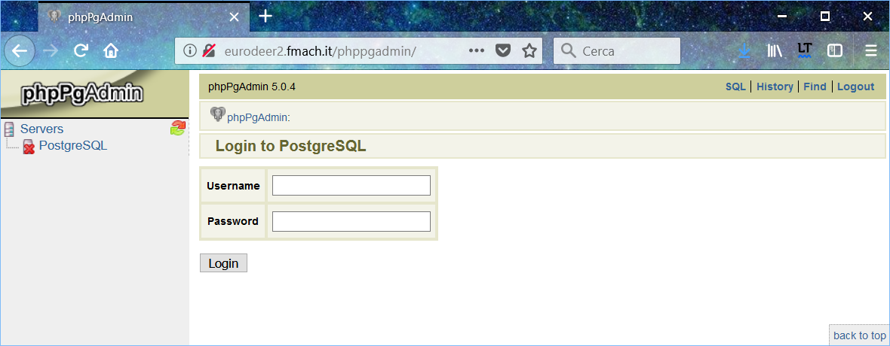

Once connected, you will see a list of database. While you can see the structure of all the database, you will only be able to access data in the database for which you are enables (i.e. eurodeer_db). You can explore the database content using the navigation menu in the left panel. Open the schema you are interested it (in most of the cases it is *main*) and select a table. In the right panel you will see the list of fields (columns) in the table with a description of their content.  
To visualize the data, click on **Browse**, to download the data in a set of possible formats (including .csv) click on **Export** (see image below).

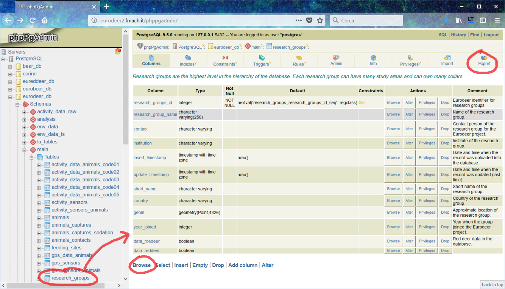

If you want to run a query (i.e. SQL code), click on **SQL** on the upper right (see image below). A new window will open where you can write your SQL. Click on **EXECUTE** to see the results on the main page.


### <a name="pgAdmin"></a>pgAdmin
[PgAdmin](https://www.pgadmin.org/) is the most popular and feature rich Open Source administration and development platform for PostgreSQL. There are two versions: 3 and 4 (the former is more intuitive, the latter more modern and powerful but without some key features available in version 3). Note that eurodeer_db uses PostgreSQL 9.5 that is compatible with both versions. This is the best tool to manage the data and explore both structure and content, including the formulation of advanced queries and the creation of new database objects.
Here below and example of the window with the connection parameters. The interface is very similat to that of phpPgAdmin.

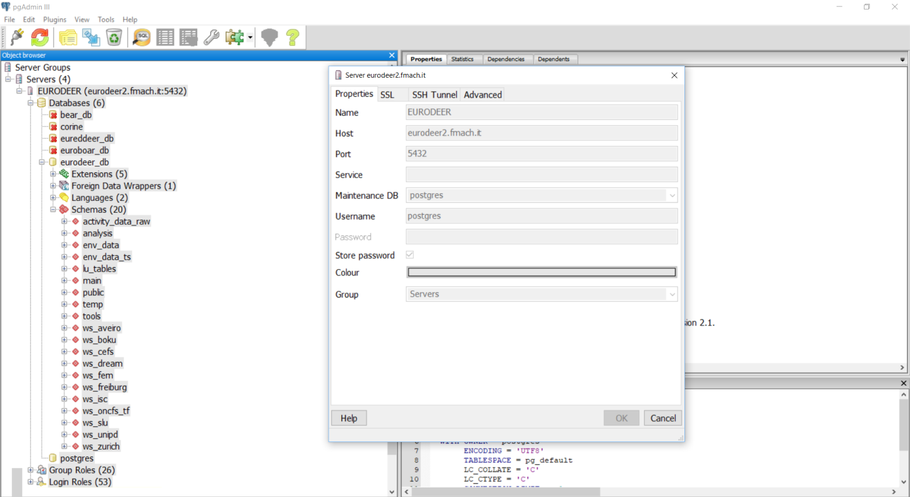

And this is the interface of pgAdmin4.  


To visualize data, click on the table in the left panel and then on the **table** icon on the menu (see below). You can add criteria (menu: **Tools/Sort-Filter**) to order the record and/or limit the selection to a subset of records.
If you select rows, you can copy/past the records as comma-separated values.


There are other (better) ways to export data. The easiest one is to write the SQl query in the SQL window (clicl on the **SQL** icon, see image below). Then, instead of simply run the query, click the button to write the data to an external .csv file (see image).  


### <a name="QGIS"></a>QGIS 

[QGIS](www.qgis.org) is a desktop GIS that is very well integrated with PostgreSQL and PostGIS and offers a large set of tools to deal with spatial data in the database. Connecting to the database is pretty simple and the process is well documented, for example [here](http://docs.qgis.org/2.18/en/docs/training_manual/databases/index.html). Data can be accessed in three steps: create a connection to the db. Open the connection. Get the data.  
 
The first time you connect with the database, you must create the connection using the **Add PostGIS Layer** icon (see screenshot below) and insert the connection parameters.


Once the connection is created, you can use the **DB Manager** interface (see below) where you can explore, preview, visualize in the main canvas and also export spatial data (both vector and raster).

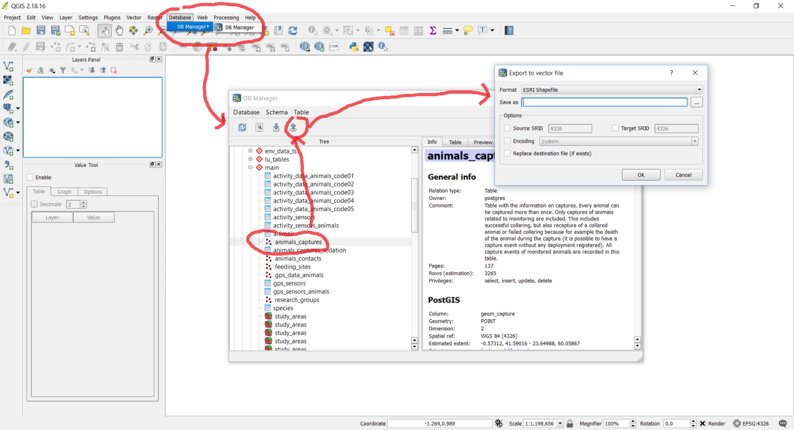

An interesting feature in QGIS is the possibility to visualize EURODEER data on top of one of the main global spatial layers like Google map or Bing map.

### <a name="R"></a>R

You can easily import data from the database into [R](https://www.r-project.org/) using a code like the one reported below (through the library RPostgreSQL):

```R   
library(RPostgreSQL)  
drv <- dbDriver("PostgreSQL")  
con <- dbConnect(drv, dbname="eurodeer_db", host="eurodeer2.fmach.it", port="5432", user="YOURUSER", password="YOURPASSWORD")  
rs <- dbSendQuery(con, "select * from main.animals")  
df <- fetch(rs,-1)  
df[1:4,]  
str(df)  
dbClearResult(rs)
```
  
In the *dbSendQuery* command, you can include any SQL code.

Note that in the database is activated [Pl/R](http://www.joeconway.com/plr.html), a tool that permits to embed R code into SQL. Contact us if you want to explore this possibility. 

### <a name="LibreOffice"></a>LibreOffice

BASE and CALC are two tools of the suite [LibreOffice](https://www.libreoffice.org/) that allow the connection with the database and offer the possibility to create queries with graphical tools, build masks, edit the data (if you have the permission to do so) in a user-friendly environment (BASE, equivalent of MS ACCESS) and visualize the information as spreadsheet (CALC, but in this case it is not possible to modify the data stored in the database).  
First of all, you have to create a connection with the database in BASE (see the two images below for the parameters to insert in the first two steps, then enter your credentials and save and register the connection).

 

Once created the connection, you will be able to visualize all the eurodeer_db tables, create form and design queries with a graphical interface.


If you want to visualize and manipulate the data in CALC (equivalent of MS EXCEL), once you created the connection with CALC, you can load eurodeer_db tables though the **Data Source Manager** (to visulize it, go to View/Data Source, see image below).


Now you can simply drag and drop the table into the spreadsheet panel (see below): Note that changes made in the spreadsheet are not reflected into the database.


### <a name="Others"></a>Other Client Tools 

There are may other clients that can be easily connected with PostgreSQL. SOme examples are SAS, STATA, MS ACCESS, MS EXCEL, ArcGIS. Most of the functionalities offered by these commercial tools are covered by The open source tools listed above. If you are used to deal with data with other tools, you can check the software specific documentation about how to connect with a PostgreSQL/PostGIS database.

